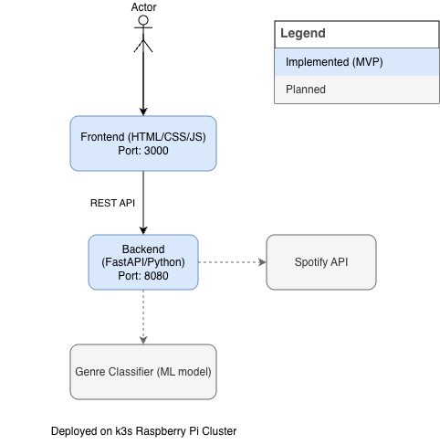

# GenreFlow
A music genre classifier that serves predictions via FastAPI

> 🚧 *Work in progress – early setup phase - API and features may change*
---
**GenreFlow** is a containerized music genre classifier built with **FastAPI**, **Docker**, and **Kubernetes**.  
It deploys to a **k3s Raspberry Pi cluster**, serving predictions for uploaded files.

## About the project

As a music lover learning to DJ, I wanted to combine my passion for music with my DevOps background. **GenreFlow** is my take on music classification. While I’m aware there are already many tools that can identify essential DJ metrics like **genre, BPM, and key**, I wanted to contribute with my own version that reflects both my curiosity and my technical background.

The main objective of the project is to **identify a song's musical characteristics, assisting you in preparing a session or assembling a new playlist.**

Beyond its purpose as a classifier, GenreFlow is also an experiment in building production-ready systems, complete with **CI/CD** **pipelines**, and **multi-architecture support** for environments like a **k3s Raspberry Pi cluster**.

---

## Architecture

This simple diagram shows the project’s current components and planned additions.



## Tech Stack

| Area | Tools |
|------|-------|
| Backend | Python · FastAPI · Uvicorn |
| Frontend | HTML · CSS · Javascript | 
| Packaging | Docker (multi-arch) |
| Orchestration | Kubernetes (k3s / k8s) |
| CI/CD | ArgoCD · GitHub Actions |
| Observability | Prometheus · Grafana |
| Integrations | Spotify Web API (preview URLs + audio features) |

---

## Repository Layout
```
genreflow/
├─ backend/              # Backend service (FastAPI + inference)
│  ├─ app/               # Application code
│  ├─ tests/             # Backend tests
│  ├─ pyproject.toml     # Poetry config (backend-only)
│  └─ Dockerfile         # Backend image
├─ frontend/             # Frontend FastAPI static UI + Dockerfile
├─ k8s/                  # Kubernetes manifests (argocd/, backend/, frontend/)
├─ scripts/              # Utility scripts
├─ logging_config.json   # Shared logging config (backend & frontend)
├─ Makefile              # Common tasks
└─ README.md
```

## Roadmap

[Future roadmap](docs/roadmap.md)


